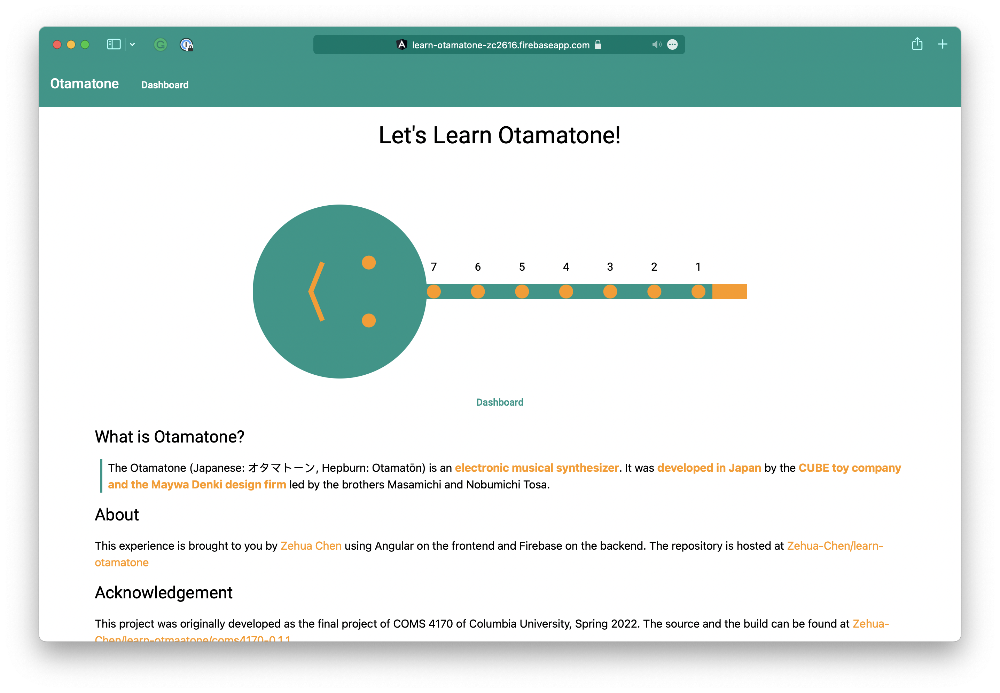

# Learn Otamatone

## Repo Content

- [web](web/): the angular web app
- [static](static/): the original practice and question clips. The current
  implementation synthesizes clips during runtime, but the original clips are
  still kept as a reference

## Get Started

### Installation

1. **Install node**
2. **Enable pnpm**: `corepack enable`
3. **Install Dependencies**: `pnpm install`

## Development

### Running Development Server

Start these two commands at the same time

- **Angular development server**: `cd web && ng serve`
- **Firebase emulator**: `firebase emulators:start`

### Deployment

[Release](.github/workflows/release.yml) is configured on run on publish of
release or on dispatch for debugging.

1. Build `web`
2. Deploy to firebase

## Acknowledgement

This project was originally developed as the final project of COMS 4170. The
source and the build can be found at
[coms4170-0.1.1](https://github.com/Zehua-Chen/learn-otamatone/releases/tag/coms4170-0.1.1).

Here are the original contributors of the project

- Zehua Chen, zc2616@columbia.edu
  - Github: [Zehua-Chen](https://github.com/Zehua-Chen)
- Yuxuan Jia, yj2680@columbia.edu
  - Github: [nuomicii](https://github.com/nuomicii)
- Shangru Li, sl4986@columbia.edu
  - Github: [sl4986](https://github.com/sl4986)
- Chenchen Deng, cd3301@columbia.edu
  - Github: [GraceD5](https://github.com/GraceD5)
